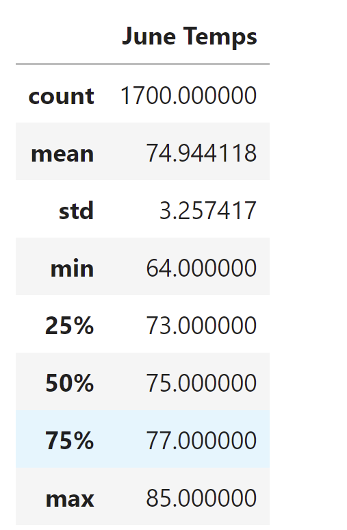
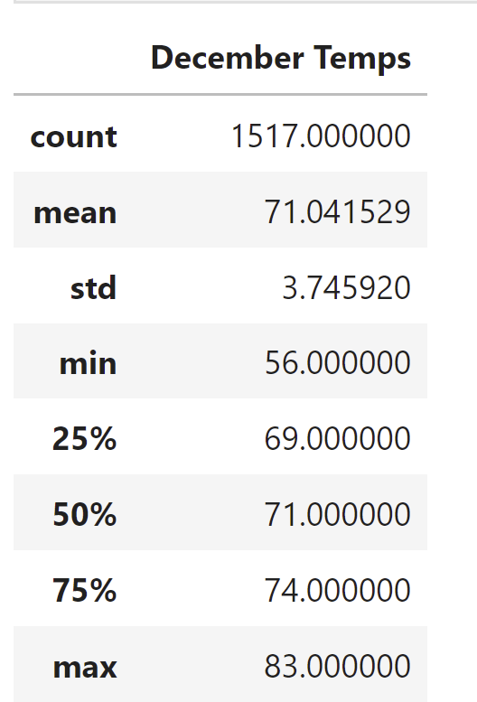

# Surfs_up
For our client, W. Avy, our goal was to determine if it would be sensible to open up another Surf and Ice Cream shop. To determine how sustainable the busiess would be, we pulled the weather statistics for the months of June and December. 

# June Temperatures
- The highest temperature for the month was 85 degrees. 
- The lowest temperature for the month of June was 64 degrees. 
- The average temperature for the month of June is 75 degrees.

When you take a look at the temperatures in June, you will see it makes sense to have a Surf and Ice Cream shop in Hawaii during the summer. 

# December Temperatures
- The highest temperature for December was 83 degrees.
- The lowest temperatures for the mopnth of December is 56 degrees. 
- The average temperature was 71 degrees. 

When looking at December, the weather drops by just a tad, but December is actually one of the best months to surf. The waves are a lot higher during the winter months. Essentially, the Surf shop would do very well during December. Maybe W. Avy could consider also selling wet-suits or hot chocolate during the winter to still generate an income. 

To conclude the analysis, it would be sustainable to have a Surf and Ice cream shop year-round in Hawaii. It would still generate lots of money during the winter despite a slight drop in temperatures. 
